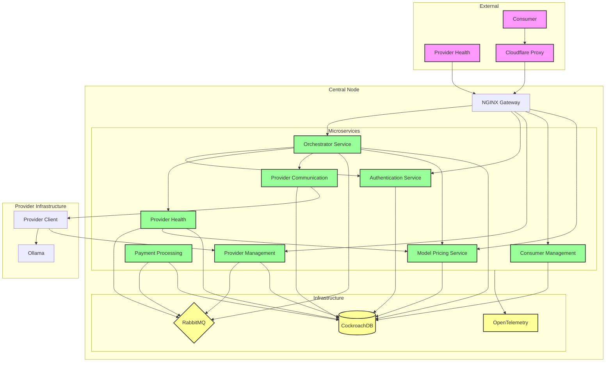
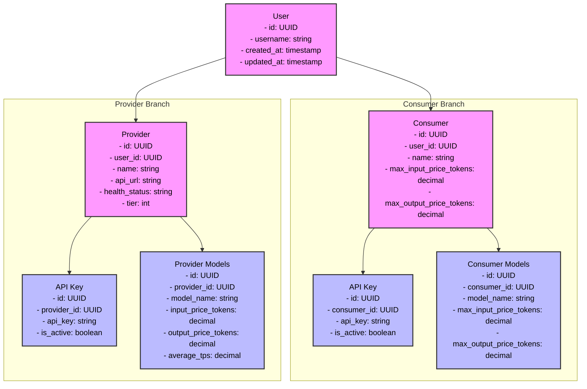

NAMES:

Inferoute
Routeollama

# System Architecture



# Services and Their Roles

All of these services listed below will run on a single server and are collectively called the central-node.

## 1.   Nginx (API Gateway) - TEST !!!

This is our main entry point for consumers. Consumers will connect using a universal API point (most likely this will be a cloudflare proxy) which will then point to this proxy.

- **Role:** The public entry point. Handles TLS termination, rate limiting, and basic routing. This is the proxy that all consumers and providers connect to (unless a provider is responding to)

-  **Flow:** Forwards incoming consumer requests to the Orchestrator and passes back responses to the consumer. Consumer request data and API-KEY (which will be in the AUTH-)

- NGINX servers takes in the request and will forward the request to Orchestrator if its a OpenAI API request.
- If it's not and its a general API request then it will forward the request to the relevant microservice.
	Like for example when a provider wants to verify an HMAC he will connect to our proxy and the proxy will forward it directly to the microservice.
- https://github.com/ollama/ollama/blob/main/docs/openai.md  NGINX should route based on the openai API standard.
- 

## 2.  Orchestrator (GO)

The orchestrator is the central controller that coordinates the request workflow. It implements a sophisticated provider selection and request handling process.

### Main Flow (ProcessRequest):

1. **API Key Validation & Balance Check**
   - Validates consumer's API key via Auth Service (`/api/auth/validate`)
   - Verifies sufficient balance (minimum $1.00)
   - Retrieves available balance information

2. **User Settings Resolution**
   - Fetches user settings from database
   - Checks `default_to_own_models` setting (defaults to true if not set)
   - This setting determines if a user's own providers should be prioritized

3. **Consumer Settings Resolution**
   - Fetches consumer's price constraints from database
   - Checks model-specific settings in `consumer_models` table first
   - Falls back to global settings from `consumers` table if no model-specific settings exist
   - Settings include maximum prices for input and output tokens

4. **Provider Selection**
   - If `default_to_own_models` is true:
     - Fetches user's own providers that support the requested model
     - Up to 3 user providers will be prioritized at the front of the provider list
   - Queries Health Service for available providers (`/api/health/providers/filter`)
   - Filters based on:
     - Requested model availability
     - Consumer's maximum price constraints
     - Provider health status
     - Provider tier
   - Providers must have:
     - Valid API URL
     - Non-nil required fields
     - Active status
     - Compatible pricing

5. **Provider Scoring & Selection**
   - Scores providers using weighted criteria based on `sort` parameter:
     - For `sort=cost` (default):
       - Price Score (70%): Inverse of total token price (input + output)
       - Performance Score (30%): Average tokens per second (TPS)
     - For `sort=throughput`:
       - Price Score (20%): Inverse of total token price
       - Performance Score (80%): Average tokens per second (TPS)
   - For non-user providers:
     - Selects top 3 providers ordered by score
   - Final provider list composition:
     - If user has own providers and `default_to_own_models` is true:
       - Up to 3 user providers at the front
       - Up to 3 non-user providers as fallbacks
     - Otherwise:
       - Up to 3 non-user providers only
   - Sort parameter can be included in request: `{"sort": "throughput"}` or `{"sort": "cost"}`

6. **Transaction Management**
   - Generates unique HMAC for request tracking
   - Creates transaction record with 'pending' status
   - Places $1.00 holding deposit via Auth Service
   - Records provider prices, model, and transaction details

7. **Request Processing**
   - Forwards request to Provider Communication Service
   - Tries providers in order (user providers first if applicable)
   - Includes:
     - Provider URL
     - HMAC
     - Original request data
     - Model information
   - Measures request latency
   - Handles provider failures by trying next provider in list

8. **Response & Cleanup**
   - Returns provider response to consumer
   - Releases holding deposit
   - Updates transaction with:
     - Input/output token counts
     - Latency metrics
     - Successful provider's ID and pricing
     - Changes status to 'payment'

9. **Payment Processing**
   - Publishes payment message to RabbitMQ
   - Includes:
     - Transaction details
     - Token counts
     - Successful provider's pricing
     - Latency metrics
   - Payment service handles actual fund transfers asynchronously

### Error Handling:
- Graceful handling of provider failures with fallback options
- Automatic holding deposit release on errors
- Comprehensive error logging
- Proper HTTP status codes for different error scenarios

### Key Features:
- Smart provider selection based on price and performance
- User provider prioritization with opt-out capability
- Fallback provider support
- Transaction tracking with successful provider updates
- Asynchronous payment processing
- Model-specific price constraints
- Holding deposit system for transaction safety

## 3.  Authentication Service (Go) - DONE !!!!  (requires INTERNAL_API_KEY so only authorized internal go services can use these APIs)

- **Role:** Manages user authentication, API key validation, and deposit handling. Users can have multiple providers and/or consumers associated with their account. Also provides deposit hold/release functionality for transaction safety.

- **Endpoints (HTTP/JSON):**

POST /api/auth/users
  - Creates a new base user account
  - Protected by X-Internal-Key
  - Example Request:
    ```json
    {
      "username": "example_user"
    }
    ```
  - Returns:
    ```json
    {
      "user": {
        "id": "uuid",
        "username": "example_user",
        "created_at": "timestamp",
        "updated_at": "timestamp"
      }
    }
    ```

POST /api/auth/entities
  - Creates a new provider or consumer entity for an existing user
  - A user can have multiple providers and/or consumers
  - Protected by X-Internal-Key
  - Example Provider Creation:
    ```json
    {
      "user_id": "user-uuid",
      "type": "provider",
      "name": "My Provider",
      "api_url": "https://provider-api.example.com"
    }
    ```
  - Example Consumer Creation:
    ```json
    {
      "user_id": "user-uuid",
      "type": "consumer",
      "name": "My Consumer"
    }
    ```
  - Returns the created provider or consumer entity

POST /api/auth/api-keys
  - Creates a new API key for a provider or consumer
  - Protected by X-Internal-Key
  - Example Request:
    ```json
    {
      "user_id": "user-uuid",
      "provider_id": "provider-uuid",  // or consumer_id for consumer keys
      "type": "provider",  // or "consumer"
      "description": "Production API key"
    }
    ```
  - Returns:
    ```json
    {
      "id": "key-uuid",
      "api_key": "sk-...",
      "description": "Production API key",
      "provider_id": "provider-uuid",  // or consumer_id
      "created_at": "timestamp"
    }
    ```

POST /api/auth/validate
  - Validates API key and checks user's details
  - For consumers: ensures minimum balance requirement ($1.00)
  - For providers: verifies active status
  - Protected by X-Internal-Key
  - Returns user details and type-specific information
  - Response includes:
    - User ID and type
    - For consumers: available balance and account status
    - For providers: tier and health status

POST /api/auth/hold
  - Places a temporary hold on a users balance of X amount
  - Only applicable for consumer requests.
  - Used before processing transactions
  - Prevents double-spending
  - Protected by X-Internal-Key

POST /api/auth/release
  - Releases a previously held deposit of X amount
  - Only applicable for consumer requests.
  - Used after successful transaction completion
  - Protected by X-Internal-Key

**Key Features:**
- Multi-entity support: Users can have multiple providers and/or consumers
- Secure internal API access with X-Internal-Key
- Flexible API key management per entity
- Transaction safety with hold/release mechanism
- Clear separation between user accounts and their provider/consumer entities

## 4.  Provider Management Service (Go) - DONE!!!!!

 - **Role:** Provides APIs for providers to manage their models, availability status, and health reporting. Acts as the entry point for provider health updates which are then published to RabbitMQ for processing by the provider-health service

 ### The service integrates with:

 - RabbitMQ: Publishes health updates to "provider_health" exchange
 - Database: Stores model configurations and provider status
 - All endpoints require authentication via provider API key and include proper error handling with appropriate HTTP status codes and error messages

-  **Endpoints (HTTP/JSON):**

- POST /api/provider/models
	- Add a new model for the authenticated provider (cannot update existing models)
	- New models are automatically set to is_active = true
	- Requires model name, service type (ollama/exolabs/llama_cpp), and token pricing
	- If model already exists for the provider, returns an error with instructions to use PUT endpoint
	- Authentication: Provider API key required

- GET /api/provider/models
	- List all models for the authenticated provider
	- Returns model configurations including active status and pricing
	- Authentication: Provider API key required

- PUT /api/provider/models/{model_id}
	- Update an existing model's configuration
	- Can modify model name, service type, and token pricing
	- Authentication: Provider API key required

- DELETE /api/provider/models/{model_id}
	- Remove a model from the provider's available models
	- Authentication: Provider API key required

- PUT /api/provider/pause
	- Update provider's pause status (true/false)
	- When paused, provider won't receive new requests
	- Returns simplified response with just pause status
	- Authentication: Provider API key required

- GET /api/provider/health
	- Get the current health status of the authenticated provider
	- Returns provider health details including:
		- Provider ID
		- Username
		- Health status (green/orange/red)
		- Tier level
		- Availability status
		- Latest latency metrics
		- Last health check timestamp
	- Authentication: Provider API key required

- POST /api/provider/health
	- Push provider's current health and model status
	- Accepts list of currently available models
	- Publishes update to RabbitMQ for processing by provider-health service
	- Authentication: Provider API key required in Bearer token

 - POST /api/provider/validate_hmac
     - Used by providers to validate HMACs
     - Requires provider API key authentication
     - Payload:
       - HMAC to validate
     - Returns:
       - Validation status
       - Original request data (if valid)
       - Transaction ID (if valid)

- PUT /api/provider/api_url
    - Update provider's API URL endpoint
    - Requires provider API key authentication
    - Payload:
      - New API URL
    - Returns:
      - Success status and message


## 5.  Provider Communication Service (Go) - DONE!!!!

- **Role:** Dispatches consumer requests (with associated HMACs) to providers and collects responses. Also provides an API for providers to validate HMACs.

- **Architecture:**
  - Built using Echo framework for HTTP routing
  - Uses CockroachDB for transaction and HMAC validation
  - Implements graceful shutdown for clean service termination
  - Runs on port 8083 in development mode

- **Authentication:**
  - Skips authentication for `/api/provider_comms/send_requests` (used by orchestrator and requires INTERNAL_API_KEY)
  - Validates API keys against the database in real-time

- **Key Components:**

  1. **Request Handler:**
     - Receives requests from the orchestrator
     - Validates provider existence and availability
     - Forwards requests to providers
     - Measures and tracks latency
     - Returns provider responses to orchestrator

  3. **Error Handling:**
     - Custom error types for different scenarios
     - Proper HTTP status codes for each error case
     - Detailed error messages for debugging

- **Endpoints (HTTP/JSON):**

  1. **POST /api/send_requests**
     - Used by orchestrator to send requests to providers
     - Payload includes:
       - Provider ID
       - HMAC
	   - provider_url
       - Request data
       - Model name
     - Returns:
       - Success/failure status
       - Provider response data
       - Latency metrics


- **Flow:**
  1. Orchestrator sends request to `/api/provider_comms/send_requests`
  2. Service validates provider and prepares request
  3. Request is sent to provider's endpoint
  4. Provider validates HMAC using `/api/provider/validate_hmac`
  5. Provider processes request and sends response
  6. Service forwards response back to orchestrator

- **Error Scenarios:**
  - Invalid provider ID
  - Provider not available
  - Invalid HMAC
  - Request timeout
  - Network failures
  - Invalid API keys

- **Monitoring:**
  - Latency tracking for provider responses
  - Request success/failure metrics
  - HMAC validation statistics
  - Provider availability monitoring


  CURRENT STATUS:

  Repsonse from provider is prited to console. We need to send to Orchestrator once build.


## 6.  Payment Processing Service (Go) with RabbitMQ - DONE

-  **Role:** Handles the asynchronous financial operations after the main workflow is complete.

-  **Workflow:** Consumes messages from a RabbitMQ queue, then debits the user (owner of consumer) balance, credits the user (owner of provider) balance, computes tokens per second, and releases the holding deposit.

- Once a transaction is completed the orchestrator should send a message to the payment service to process the transaction.
- The rabbitmq will include the following details:
	- Consumer ID
	- Provider ID
	- HMAC
	- Model name
	- Total input tokens
	- Total output tokens
	- Latency
	- status (which at this point should be set to payment)

- It is the job of the payment sevice to consume those rabitMQ messages and work out the following and update the transactions table:
	- Tokens per second (total output tokens / latency)
	- Consumer cost (total input tokens + total output tokens) * price per token ( each provider will have these prices attach to their models in the provider_models table)
	- Provider earnings - Consumer cost - 5%  (the 5% is the fee for the central node) - We ahouls also actually add another column to the transactions table to show the amount of the fee that is taken by our service. 


- **Technology:** Uses RabbitMQ for message queuing.

## 7.Consumer management service services (GO)

-  **Role:** Provides API to consumers.
	- **Consumers** can check their spend based on keys
	- **Providers** can check their profit based on models and time (need to implement in provider-management)


## 8. Provider-Health (GO) - DONE!!!!!!

**Role:** Processes health updates from providers via RabbitMQ, maintains provider health status, and provides APIs for health-related operations.
The service has several core components:

- **RabbitMQ Message Processing:**
	- Consumes health check messages from the "provider_health" exchange with "health_updates" routing key
	- For each health update:
		- Updates existing models' metadata without changing pricing
		- For new models:
			1. Checks model_pricing_data table for model-specific pricing
			2. Falls back to default pricing from model_pricing_data if model-specific pricing not found
		- Marks database models as inactive if not in health update
		- Updates provider health status (green/orange/red):
			- Green: All registered models are available
			- Orange: Some models are available
			- Red: No models are available
		- Updates last_health_check timestamp
		- Records health check in provider_health_history table

- **Health Status Management:**
Health status uses a traffic light system (green/orange/red) in both provider_status and provider_model tables
is_available field in provider_status is set to false when health status is red

- **Stale providers (no health check for 30+ minutes) can be marked unhealthy via API endpoint**

- **Provider Tier System:**
	- Providers are assigned tiers (1-3) based on 30-day health history:
		- Tier 1: 99%+ green status
		- Tier 2: 95-99% green status
		- Tier 3: <95% green status
	- Tier updates can be triggered via API endpoint

- **APIs:**

Note: The periodic checking of stale providers and tier updates has been moved to the Scheduling Service, which calls the respective APIs at configured intervals.

 - GET /api/health/providers/healthy:  Get a list of healthy providers (providers that are green)
 - GET /api/health/providers/filter: Get a list of healthy providers offering a specific model within cost constraints	
 - GET /api/health/provider/:provider_id: Get the health status of a specific provider
 - GET /api/health/providers/user: Get a list of healthy providers (green/orange) belonging to a specific user, optionally filtered by model name
 - POST /api/health/providers/update-tiers: Manually triggers the tier update process for all providers based on their health history (protected by INTERNAL_API_KEY)
 - POST /api/health/providers/check-stale - Manually triggers the check for stale providers that haven't sent health updates recently. (protected by INTERNAL_API_KEY)

**API Details:**

1. **GET /api/health/providers/healthy**
   - Returns only providers with 'green' health status
   - Includes provider ID, username, tier, and latency metrics
   - Sorted by tier and latency

2. **GET /api/health/providers/filter**
   - Query Parameters:
     - model_name (required): Name of the model to filter by (supports both base model names and :latest variants)
     - tier (optional): Filter by specific tier
     - max_cost (required): Maximum cost per token
   - Returns providers with 'green' or 'orange' status
   - Includes pricing and performance metrics
   - Sorted by tier and average TPS

3. **GET /api/health/provider/:provider_id**
   - Returns detailed health information for a specific provider
   - Includes current health status, tier, availability, and latest metrics

4. **GET /api/health/providers/user**
   - Query Parameters:
     - user_id (required): User ID to filter by
     - model_name (optional): Filter by specific model (supports both base model names and :latest variants)
   - Returns all non-red status providers belonging to the user
   - Includes model pricing and performance metrics if model filter applied
   - Excludes paused or unavailable providers
   - Sorted by tier and average TPS

5. **POST /api/health/providers/update-tiers**
   - Internal endpoint (requires INTERNAL_API_KEY)
   - Updates provider tiers based on 30-day health history
   - Returns count of providers updated

6. **POST /api/health/providers/check-stale**
   - Internal endpoint (requires INTERNAL_API_KEY)
   - Marks providers as unhealthy if no recent health checks
   - Returns count of providers marked as stale

We will need some Cloud cron thing to run the check for stale providers and update tiers from externally.


## 9. Model Pricing Service (GO)

- **Role:** Manages and provides access to average pricing information for all models across providers. Helps consumers understand typical costs before making requests. Also maintains default pricing for unknown models and collects time-series pricing data for candlestick charts. The service includes a scheduler that runs every minute to collect and store pricing metrics.

- **Endpoints (HTTP/JSON):**

  1. **GET Model Prices** - Public API
     - Endpoint: `POST /api/model-pricing/get-prices`
     - Description: Returns average input and output token prices for requested models
     - Authentication: Requires Provider API key
     - Request:
       ```json
       {
         "models": ["llama2", "mistral", "gpt4"]
       }
       ```
     - Response:
       ```json
       {
         "model_prices": [
           {
             "model_name": "llama2",

             "avg_input_price": 0.0002,
             "avg_output_price": 0.0003,
             "sample_size": 15
           },
           {
             "model_name": "default",
             "avg_input_price": 0.0002,
             "avg_output_price": 0.0003,
             "sample_size": 50
           }
         ]
       }
       ```
     - Notes:
       - Default pricing is included in the response
       - Uses default pricing if specific model not found
       - Prices are per token
       - Sample size indicates number of providers used in average
       - Used by Provider Health service when adding new models during health updates
       
  2. **Get Model Pricing Data** - Public API
     - Endpoint: `GET /api/model-pricing/pricing-data/:model_name`
     - Description: Returns time-series pricing data for a specific model in a format suitable for candlestick charts
     - Authentication: Requires Provider API key
     - Query Parameters:
       - `limit` (optional): Number of data points to return (default: 60)
     - Response:
       ```json
       {
         "data": [
           {
             "model_name": "llama3.2",
             "timestamp": "2023-06-15T14:30:00Z",
             "input_open": 0.00020,
             "input_high": 0.00025,
             "input_low": 0.00018,
             "input_close": 0.00022,
             "output_open": 0.00030,
             "output_high": 0.00035,
             "output_low": 0.00028,
             "output_close": 0.00032,
             "volume_input": 15000,
             "volume_output": 12000
           },
           {
             "model_name": "llama3.2",
             "timestamp": "2023-06-15T14:29:00Z",
             "input_open": 0.00018,
             "input_high": 0.00022,
             "input_low": 0.00018,
             "input_close": 0.00020,
             "output_open": 0.00028,
             "output_high": 0.00032,
             "output_low": 0.00028,
             "output_close": 0.00030,
             "volume_input": 10000,
             "volume_output": 8000
           }
         ]
       }
       ```
     - Notes:
       - Data is ordered by timestamp in descending order (newest first)
       - Timestamps are in RFC3339 format
       - Prices are per token
       - Volume_input represents the sum of input tokens from all transactions for that model
       - Volume_output represents the sum of output tokens from all transactions for that model

- **Scheduler:**
  - The service includes an internal scheduler that runs every minute
  - On each run, it collects pricing metrics for all active models:
    - Highest price (input_high, output_high)
    - Lowest price (input_low, output_low)
    - Average price (input_close, output_close)
    - Previous close price (input_open, output_open)
    - Transaction volume (input tokens and output tokens)
  - Data is stored in the `model_pricing_data` table
  - The scheduler runs automatically when the service starts and continues until shutdown
  - This time-series data enables visualization of price trends using candlestick charts

- **Key Features:**
  - Maintains and auto-updates default pricing for unknown models based on global averages
  - Calculates model-specific averages from active provider models
  - Normalizes model names by removing ":latest" suffix for consistent data tracking
  - Tracks input and output token volumes separately for detailed usage metrics
  - Helps consumers estimate costs before requests
  - Default pricing ensures system can handle requests for new or uncommon models
  - Provides pricing data for Provider Health service when adding new models
  - Collects and stores time-series pricing data for visualization in candlestick charts
  - Fully automatic minute-by-minute data collection via internal scheduler without requiring API calls

## 10.  CockroachDB - DONE!!!!

-  **Role:** Distributed data store for users, API keys, HMACs, provider data, and transaction records.

## 11.  Logging and Monitoring Service

-  **Role:** Capeture and store logs from all of our services.

Use OpenTelemetry to capture logs from all of our services and send to datadog
OR use this - https://www.multiplayer.app/docs/  Auto-documentation and provides network map


## 11. Scheduling Service:

- We need to create an external service that runs on GCP  that runs the scheduling for each of our APIs that need to be manually triggered. This should connect to any of our central nodees as cockcraochDB will keep the DB consistent across all of our Nodes

#### provider_health 
 - check stale providers
 - update tiers

### 12. Provider client (GO)


- Should be applied via Docker - make sure docker is small and efficient as can be.
- Documentation to run client on your own (this will include the cron jon to send health updates)

-  **Role:** GO client running on provider side that will be used to send the health updates to the central node, pass request to Ollama and validate HMAC requests. 
- Also runs 

- It should also have a very short timeout set so that if the procider client cannot connect it local Ollama it will let our Procider-communiction service know about it. Our provider-communication service should then try to send the request to another provider.
- Client should also first check whether they are busy performing inference and if so reject the request
- Will also be running  API that exposes nvidia-smi so nginx can check the utilization of the CPU. Check here.
https://github.com/Opa-/nvidia-smi-rest/tree/main
https://github.com/kesor/ollama-proxy/blob/main/Dockerfile

- We should also collect:
	- GPU TYPE 
	- Number of GPUs
	- Current ngrok or cloudflare URL that is running on the provider machine
	- Save the utilization in our health check as this will give us some usage stats overtime.


### 13. Autoamatic routing based on request.

https://github.com/lm-sys/RouteLLM
https://arxiv.org/abs/2406.18665

- See if we can implement this so that users don't specify a Model and we choose the best/cheapest model based on the request.
- Allow a user to set a strong model and a weaker model and we can use this to route requests, based on their incoming text.

### 14. Documentation using fern

Rightbrain Petes new company uses fern and the documentation looks so good.
Use fern - book a demo.
https://www.buildwithfern.com


################ Initial Account creation process


Providers

All pricing for providers are set based on a 1M tokens 


### Consumers 

	1. Logs in using google, github etc..
	2. We create a consumer row in the database.
	3. User is send to welcome page where he is asked for min and max price per 1,000,000 input tokens and per 1,000,000 output tokens. (explain this is a global setting and can be overridden for a specific model)
	4. User clicks next and is sent to a page where he can create an API key.
	5. Shows them example of how to use the service (basically worsk out of the box like OpenAI comopatible API)

# Revised Request-Response Workflow

## 1. Consumer Request Initiation:
- Consumer sends a request to the OpenAI-compatible endpoints (/v1/chat/completions, /v1/completions)
- Request includes API key in Authorization header (Bearer format) and model-specific parameters
- Request is received by Nginx which routes to the Orchestrator service

## 2. Authentication & Validation:
- Orchestrator validates the API key through the Auth Service (/api/auth/validate)
- Validates consumer exists and has sufficient balance
- Places a $1 holding deposit via Auth Service (/api/auth/hold)
- Verifies consumer's price limits for the requested model

## 3. Provider Selection:
- Queries Provider Health Service for available providers matching:
  - Requested model
  - Consumer's maximum price constraints
  - Health status (green/orange)
  - Provider tier requirements
- Selects optimal provider based on price, latency, and tier

## 4. Transaction Initialization:
- Creates a transaction record with 'pending' status
- Generates HMAC for request validation
- Records initial transaction details (consumer, provider, model, pricing)

## 5. Request Processing:
- Forwards request to Provider Communication Service with:
  - Provider's URL
  - HMAC
  - Original request data
  - Model name
- Provider Communication Service sends request to provider
- Provider validates HMAC via Provider Management Service
- Provider processes request and returns response

## 6. Response Handling:
- Provider Communication Service receives response
- Returns response data, latency metrics, and token counts to Orchestrator
- Orchestrator immediately forwards response to consumer

## 7. Transaction Finalization:
- Updates transaction with:
  - Total input/output tokens
  - Latency metrics
  - Changes status to 'payment'
- Publishes payment message to RabbitMQ with:
  - Consumer/Provider IDs
  - Token counts
  - Pricing information
  - Latency data

## 8. Asynchronous Payment Processing:
- Payment Processing Service consumes RabbitMQ message
- Calculates:
  - Tokens per second
  - Consumer cost
  - Provider earnings
  - Service fee (5%)
- Updates balances:
  - Debits consumer
  - Credits provider
  - Releases holding deposit
- Updates transaction status to 'completed'

## Techstack 

- For all our GO microservices we will utilise the echo framework.
- Opensentry as our NGINX
- CockcroachDB as your database.

# User Management

The platform implements a flexible user management system where users can be associated with either consumers or providers:



## User Types and Relationships

- **Users**: Base entity containing authentication information
  - Unique ID (UUID)
  - Username
  - Created/Updated timestamps
  - Authentication details

- **Consumers**: Extended user type for those consuming inference services
  - Links to user via user_id
  - Global settings for maximum price per 1M input/output tokens
  - Balance and payment information
  - Can override pricing settings per model via consumer_models table

- **Providers**: Extended user type for those providing inference services
  - Links to user via user_id
  - Provider URL endpoint
  - Health status and tier information
  - Model configurations and pricing
  - Earnings and performance metrics

## Creating Users

Users can be created as either consumers or providers through the `/api/auth/users` endpoint. The type of user is determined by the presence of an `api_url` in the request:

### Creating a Consumer
```json
POST /api/auth/users
{
    "username": "consumer_user",
    "name": "Consumer Name",
    "balance": 1000
}
```

### Creating a Provider
```json
POST /api/auth/users
{
    "username": "provider_user",
    "name": "Provider Name",
    "balance": 1000,
    "api_url": "http://provider-endpoint:8080"
}
```

The presence of the `api_url` field determines whether the user is created as a provider or consumer. After user creation:
- Consumers can set their price constraints and create API keys
- Providers can register models, set pricing, and manage their health status

# Model Naming Considerations

## The ":latest" Suffix Issue

Our system handles model names that may be stored with or without a ":latest" suffix. For example, the same model might be referenced as either "llama3.2" or "llama3.2:latest" in different contexts:

- When models are pushed from providers, they may contain the ":latest" suffix in the model name
- When providers respond to users in JSON responses, they might send the model name without the ":latest" suffix
- Transactions might reference either form of the model name

This discrepancy can cause lookup failures, particularly in the payment processing service, which needs to match transaction model names against provider_models records. 

### Solution

To address this issue, our payment processing service implements a two-step lookup approach:

1. First query using the exact model name as provided
2. If no results are found, fall back to querying with ":latest" suffix appended

This pattern is implemented in several places:
- When checking for pricing cheating
- When retrieving provider model statistics
- When updating provider model statistics

Example implementation:
```go
// Try exact match first
err := tx.QueryRowContext(ctx, `
    SELECT id, updated_at 
    FROM provider_models 
    WHERE provider_id = $1 AND model_name = $2`,
    providerID, modelName,
).Scan(&providerModelID, &modelUpdatedAt)

// Fall back to ":latest" suffix if no rows found
if err == sql.ErrNoRows {
    err = tx.QueryRowContext(ctx, `
        SELECT id, updated_at 
        FROM provider_models 
        WHERE provider_id = $1 AND model_name = $2`,
        providerID, modelName+":latest",
    ).Scan(&providerModelID, &modelUpdatedAt)
}
```

This approach ensures that transactions can be processed successfully regardless of which form of the model name is used.
